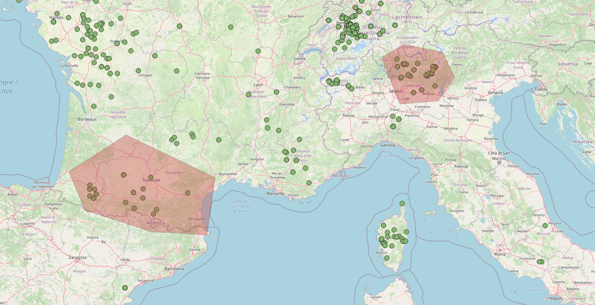

# Working with GeoJSON data

This vignette explain some tips in order to work and visualize SMARTER
data using the [GeoJSON
endpoints](https://webserver.ibba.cnr.it/smarter-api/docs/#/GeoJSON):
These endpoints in particular retrieve all the samples with GPS
coordinates (like using the `locations__exists=TRUE` parameter with the
[`get_smarter_samples()`](https://cnr-ibba.github.io/r-smarter-api/reference/get_smarter_samples.md)
method) and then return results as a [Simple
Feature](https://r-spatial.github.io/sf/index.html). This could help you
doing spatial queries such as collect samples within a certain area or
calculate variables from a raster object. Moreover, is it possible to
display data using maps or plots. Here are some libraries used in this
vignette you may find useful:

``` r
library(sf)
library(leaflet)
library(ggplot2)
library(ggspatial)
library(rnaturalearth)
library(rnaturalearthdata)
library(elevatr)
library(geodata)
library(terra)
library(progress)
library(smarterapi)
```

## Get data using parameters

You can collect GeoJSON data using parameters, like using the
[`get_smarter_samples()`](https://cnr-ibba.github.io/r-smarter-api/reference/get_smarter_samples.md)
function. This function will parse the GeoJSON data to return a [Simple
Feature](https://r-spatial.github.io/sf/index.html) object, which is a
tibble object with a geometry column. For example, try to collect data
for the *Sheep hapmap background* dataset:

``` r
hapmap_dataset <- get_smarter_datasets(query = list(
  species = "Sheep",
  type = "background",
  type = "genotypes",
  search = "hapmap"
))
hapmap_data <- get_smarter_geojson(species = "Sheep", query = list(
  dataset = hapmap_dataset["_id.$oid"][1],
  country = "Italy"
))
```

Here is a preview of the first rows of the `hapmap_data` object:

|   breed    | breed_code |     chip_name      | country |             metadata              |
|:----------:|:----------:|:------------------:|:-------:|:---------------------------------:|
| Altamurana |    ALT     | IlluminaOvineSNP50 |  Italy  | { “location_source”: “Altamura” } |
| Altamurana |    ALT     | IlluminaOvineSNP50 |  Italy  | { “location_source”: “Altamura” } |
| Altamurana |    ALT     | IlluminaOvineSNP50 |  Italy  | { “location_source”: “Altamura” } |
| Altamurana |    ALT     | IlluminaOvineSNP50 |  Italy  | { “location_source”: “Altamura” } |
| Altamurana |    ALT     | IlluminaOvineSNP50 |  Italy  | { “location_source”: “Altamura” } |
| Altamurana |    ALT     | IlluminaOvineSNP50 |  Italy  | { “location_source”: “Altamura” } |

Table continues below

| original_id | sex |     smarter_id     |  species   |    type    |
|:-----------:|:---:|:------------------:|:----------:|:----------:|
|    ALT1     | NA  | ITOA-ALT-000001084 | Ovis aries | background |
|    ALT23    | NA  | ITOA-ALT-000001085 | Ovis aries | background |
|    ALT10    | NA  | ITOA-ALT-000001086 | Ovis aries | background |
|    ALT20    | NA  | ITOA-ALT-000001087 | Ovis aries | background |
|    ALT21    | NA  | ITOA-ALT-000001088 | Ovis aries | background |
|    ALT22    | NA  | ITOA-ALT-000001089 | Ovis aries | background |

Table continues below

|          geometry          |
|:--------------------------:|
| MULTIPOINT ((16.55 40.82)) |
| MULTIPOINT ((16.55 40.82)) |
| MULTIPOINT ((16.55 40.82)) |
| MULTIPOINT ((16.55 40.82)) |
| MULTIPOINT ((16.55 40.82)) |
| MULTIPOINT ((16.55 40.82)) |

## Filter data using spatial queries

An alternative approach in selecting samples exploits *spatial queries*.
In this example, we imported the goat dataset as
[geojson](https://en.wikipedia.org/wiki/GeoJSON) file into
[qgis](https://www.qgis.org/en/site/). Then we created two *polygons*
features in correspondance of the samples we want to collect using GPS
coordinates like in the following picture:



select by polygons

Then we exported the two polygons as a *shapefile*. Here is how we can
do a spatial query with
[`st_intersects()`](https://r-spatial.github.io/sf/reference/geos_binary_pred.html)
in order to collect samples in correspondance of the two areas of
interest:

``` r
polygons_file <- system.file("extdata", "polygons.shp", package = "smarterapi")
polygons <- sf::st_read(polygons_file)
goat_data <- get_smarter_geojson("Goat", query = list(type = "background"))
sel_sgbp <- sf::st_intersects(goat_data, polygons)
sel_logical <- lengths(sel_sgbp) > 0
selected_goats <- goat_data[sel_logical, ]
```

The same query could be done using the
[`get_smarter_geojson()`](https://cnr-ibba.github.io/r-smarter-api/reference/get_smarter_geojson.md)
function and providing the polygons as an argument:

``` r
selected_goats <- get_smarter_geojson(
  "Goat",
  query = list(type = "background"),
  polygons = polygons
)
```

This means that you can also provide any `sf` object as a polygon
argument. Here we select by country, but using spatial queries:

``` r
italy <- rnaturalearth::ne_countries(scale = "medium", returnclass = "sf") %>%
  dplyr::filter(name == "Italy")
italy_goats <- get_smarter_geojson(
  "Goat",
  query = list(type = "background"),
  polygons = italy
)
```

## Convert from MULTIPOINTS to POINT

The
[`get_smarter_geojson()`](https://cnr-ibba.github.io/r-smarter-api/reference/get_smarter_geojson.md)
methods returns a `sf` *MULTIPOINTS* objects since multiple locations
could be collected for each animal, for example for *transhumant*
samples. However, for simplicity, we can focus our analyses using only
one GPS coordinate, transforming this *MULTIPOINTS* object into a
*POINT* object:

``` r
hapmap_data <- hapmap_data %>% sf::st_cast("POINT", do_split = FALSE)
hapmap_data
#> Simple feature collection with 92 features and 11 fields
#> Geometry type: POINT
#> Dimension:     XY
#> Bounding box:  xmin: 9.016667 ymin: 37 xmax: 18.16667 ymax: 40.81667
#> Geodetic CRS:  WGS 84
#> # A tibble: 92 × 12
#>    breed      breed_code chip_name    country dataset metadata original_id   sex
#>    <chr>      <chr>      <chr>        <chr>   <chr>   <chr>    <chr>       <int>
#>  1 Altamurana ALT        IlluminaOvi… Italy   "{ \"$… "{ \"lo… ALT1           NA
#>  2 Altamurana ALT        IlluminaOvi… Italy   "{ \"$… "{ \"lo… ALT23          NA
#>  3 Altamurana ALT        IlluminaOvi… Italy   "{ \"$… "{ \"lo… ALT10          NA
#>  4 Altamurana ALT        IlluminaOvi… Italy   "{ \"$… "{ \"lo… ALT20          NA
#>  5 Altamurana ALT        IlluminaOvi… Italy   "{ \"$… "{ \"lo… ALT21          NA
#>  6 Altamurana ALT        IlluminaOvi… Italy   "{ \"$… "{ \"lo… ALT22          NA
#>  7 Altamurana ALT        IlluminaOvi… Italy   "{ \"$… "{ \"lo… ALT15          NA
#>  8 Altamurana ALT        IlluminaOvi… Italy   "{ \"$… "{ \"lo… ALT8           NA
#>  9 Altamurana ALT        IlluminaOvi… Italy   "{ \"$… "{ \"lo… ALT16          NA
#> 10 Altamurana ALT        IlluminaOvi… Italy   "{ \"$… "{ \"lo… ALT24          NA
#> # ℹ 82 more rows
#> # ℹ 4 more variables: smarter_id <chr>, species <chr>, type <chr>,
#> #   geometry <POINT [°]>
```

The *warnings* you see in your terminal tell you that you are
considering only the first coordinate object from each *MULTIPOINT*
collection.

## Visualize SMARTER GPS data

### Displaying data using ggplot2

`sf` data could be visualized using ggplot2. In the following examples
we derive the countries from the `rnaturalearth` package, then we will
zoom the plot to the selected points of the previous example:

``` r
# determine a bounding box around our samples
bbox <- sf::st_bbox(hapmap_data)

# collect the world countries as sf
world <- rnaturalearth::ne_countries(scale = "medium", returnclass = "sf")

# plot the data: use the bounding box to zoom the plot on our samples
ggplot2::ggplot() +
  ggplot2::geom_sf(data = world, fill = "antiquewhite") +
  ggplot2::geom_sf(data = hapmap_data, color = "blue", size = 5) +
  ggspatial::annotation_scale(location = "bl", width_hint = 0.5) +
  ggspatial::annotation_north_arrow(
    location = "bl",
    which_north = "true",
    pad_x = ggplot2::unit(0.75, "in"),
    pad_y = ggplot2::unit(0.5, "in"),
    style = ggspatial::north_arrow_fancy_orienteering
  ) +
  ggspatial::coord_sf(
    xlim = c(bbox$xmin, bbox$xmax),
    ylim = c(bbox$ymin, bbox$ymax)
  ) +
  ggplot2::theme_bw() +
  ggplot2::theme(plot.title = ggplot2::element_text(hjust = 0.5)) +
  ggplot2::xlab("longitude") +
  ggplot2::ylab("latitude") +
  ggplot2::ggtitle("Selected samples")
```


See [this post](https://r-spatial.org/r/2018/10/25/ggplot2-sf.html) for
a nice introduction to `sf` and `ggplot2`.

### Displaying data using leaflet

Data could be visualized in an interactive way using *R* `leaflet`
library:

``` r
leaflet::leaflet(
  data = hapmap_data,
  options = leaflet::leafletOptions(minZoom = 5, maxZoom = 10)
) %>%
  leaflet::addTiles() %>%
  leaflet::addMarkers(
    clusterOptions = leaflet::markerClusterOptions(), label = ~smarter_id
  )
```

See [Leaflet for R](https://rstudio.github.io/leaflet/) documentation
for more information.

## Integrate data with external sources

### Derive elevation data using elevatr

We can collect elevation data using the `elevatr` package. The following
functions returns the input dataframe with `elevation` and `elev_units`
as additional columns:

``` r
prj_dd <- "EPSG:4326"
hapmap_data_elev <- elevatr::get_elev_point(
  hapmap_data,
  prj = prj_dd,
  src = "aws"
)
```

See [elevatr
vignette](https://cran.r-project.org/package=elevatr/vignettes/introduction_to_elevatr.html)
or [elevatr](https://rspatialdata.github.io/elevation.html) tutorial in
[rspatialdata](https://rspatialdata.github.io/index.html) documentation
for more information and examples.

### Add worldclim data from rasters

We can collect data from [worldclim](https://www.worldclim.org/)
database using the `geodata` package: this package in particular collect
*raster* data from different sources (see geodata [reference
manual](https://cran.r-project.org/package=geodata/geodata.pdf) for more
information). In this example, we collect the *raster* with the lowest
definition (10min =~ 340km) for worldclim [bioclimatic
variables](https://www.worldclim.org/data/bioclim.html) and elevation.
Raster images will be placed in the `tempdir` path. Then using
[`terra::extract`](https://rspatial.github.io/terra/reference/extract.html)
we calculate the values for our data, after converting them into terra
*SpatialVectors*:

``` r
worldclim_bio <- geodata::worldclim_global(
  var = "bio",
  res = 10,
  path = tempdir()
)
bio_data <- terra::extract(worldclim_bio, terra::vect(hapmap_data))

worldclim_elev <- geodata::worldclim_global(
  var = "elev",
  res = 10,
  path = tempdir()
)
elev_data <- terra::extract(worldclim_elev, terra::vect(hapmap_data))

hapmap_data_worldclim <- cbind(hapmap_data, merge(elev_data, bio_data))
```

See [raster extraction](https://www.worldclim.org/data/bioclim.html)
from [geocomputation with R](https://r.geocompx.org/index.html) for more
information.
